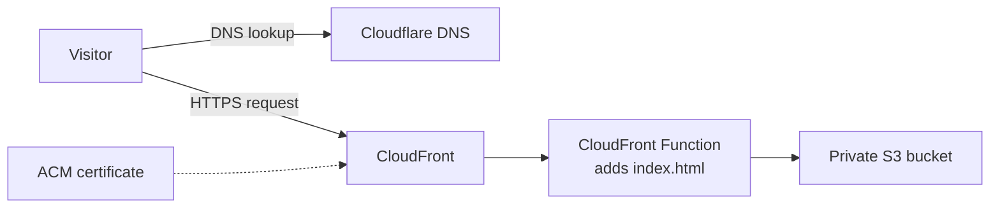
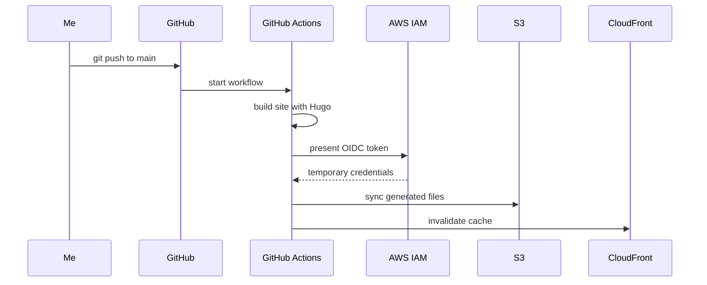
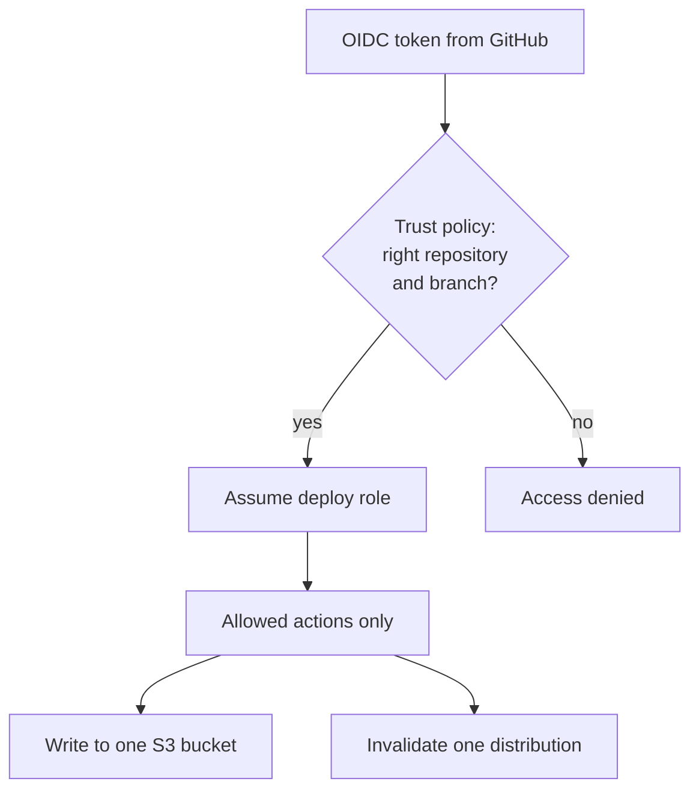

+++
title = "How this blog is built and deployed"
date = '2026-10-05T10:05:00+02:00'
draft = false
tags = ["aws", "cloudfront", "s3", "github-actions"]
+++

I wanted to create a simple static HTML blog. Among many technologies, I rapidly settled for Hugo's ease of use and large user base. Architecture-wise, this site is a set of static files generated by Hugo, stored in a private S3 bucket and served through CloudFront. Publishing a post means pushing a Markdown file to GitHub, and launching a CI/CD pipeline ; everything after that is handled automatically.

## Why a static site

I used to have a VPS at Infomaniak. While I like their sustainability approach, I wanted ot try out the ease-of-use of the serverless framework without having to rent a dedicated VM.\
A blog does not need a server. Every page can be generated ahead of time, which leaves nothing to patch, nothing to scale and almost nothing to pay for. I wanted three things:

- the source in Git: every change is versioned (I am a big proponent of versioning and declarative approaches in general) ;
- reduce friction: deployment on commit, so writing is the only manual step: I can write an article anywhere and have it posted from anywhere ;
- hosting on AWS managed services, with no machine to look after.

## The pieces

| Piece | Role |
| --- | --- |
| Hugo, with the TeXify3 theme | Turns Markdown into HTML |
| GitHub | Stores the source code |
| GitHub Actions | Builds and deploys on every push |
| Amazon S3 | Stores the generated files in a private bucket |
| Amazon CloudFront | Serves the site over HTTPS from edge locations |
| AWS Certificate Manager | Provides the TLS certificate |
| AWS IAM | Lets GitHub Actions deploy without stored access keys |
| Cloudflare DNS | Points the domain at CloudFront |

## How a page reaches a visitor



CloudFront is the only service allowed to read from the S3 bucket, through an origin access control and a bucket policy that names this one distribution.

That choice has a side effect. Hugo writes each page as a folder with an `index.html` inside, such as `/posts/hello/index.html`. A private S3 origin does not resolve `/posts/hello/` to that file by itself, so a small CloudFront Function rewrites the request on the way in:

```javascript
function handler(event) {
  var request = event.request;
  var uri = request.uri;
  if (uri.endsWith('/')) {
    request.uri += 'index.html';
  } else if (!uri.split('/').pop().includes('.')) {
    request.uri += '/index.html';
  }
  return request;
}
```

The certificate comes from AWS Certificate Manager and it has to be requested in the `us-east-1` region for CloudFront to accept it, whatever the region in which the bucket lives in, and it is validated with a single DNS record.

## How a post gets published



The workflow installs Hugo, Dart Sass and the theme's PostCSS dependencies, builds the site, copies the output to the bucket and clears the CloudFront cache. A full run takes less than a minute.

## Deploying without stored keys

No AWS access key is saved in the repository. GitHub Actions proves its identity to AWS with a short-lived OpenID Connect token, and IAM exchanges it for temporary credentials tied to one role.



The role can do two things: write to this bucket and invalidate this distribution. If the workflow were ever compromised, that is the limit of the damage.

## Cost

For a site this size the bill should stay close to zero. Storage is a few megabytes, each deploy uploads a couple of hundred small files, and the only part that grows with usage is traffic through CloudFront.

## What's next

More articles coming soon now that publishing is one commit away!\
I might also redeploy this website through Terraform in the near future.